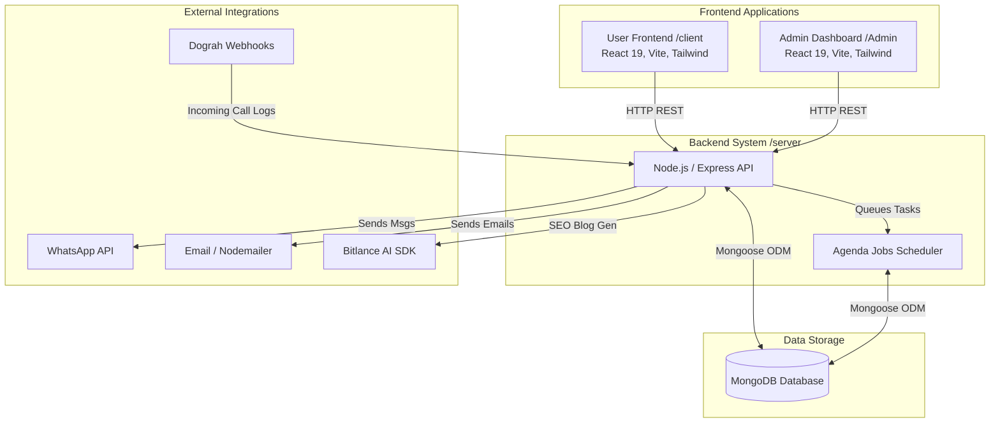

# Loteleite SIECcation - System Architecture

This repository contains the Loteleite SIECcation platform, structured as a monorepo consisting of three primary modules: `client`, `Admin`, and `server`.

## High-Level Architecture

The system follows a client-server architecture where two distinct React-based frontends (`client` and `Admin`) interact with a centralized Node.js/Express REST API (`server`). The backend is backed by a MongoDB database and utilizes Agenda for background job processing.



### 1. User Frontend (`/client`)
The main user-facing application for educational content and interaction.
- **Framework**: React 19 + Vite
- **Styling**: Tailwind CSS 4, Framer Motion for animations.
- **Routing**: React Router DOM
- **UI Components**: Lucide React (icons), Recharts (charts), React Markdown & Rehype/Remark for rendering blog content.

### 2. Admin Dashboard (`/Admin`)
A comprehensive dashboard for administrators to manage leads, blogs, and system data.
- **Framework**: React 19 + Vite
- **Styling**: Tailwind CSS 4
- **UI/UX Libraries**: `@base-ui/react`, `@tanstack/react-table` (data grids), `@dnd-kit` (drag and drop features), `vaul` (drawers), `sonner` (toast notifications), Next Themes (dark/light mode).
- **Validation**: Zod for schema and form validation.

### 3. Backend Server (`/server`)
A robust RESTful API built to serve both the client application and the admin dashboard.
- **Runtime & Framework**: Node.js, Express.js (v5)
- **Database**: MongoDB (via Mongoose ODM)
- **Authentication**: JWT (JSON Web Tokens) with `bcryptjs` for password hashing.
- **Background Jobs**: `agenda` for task scheduling (e.g., `leadJobs`, `dograhJobs`).
- **File Uploads**: `multer` handling multipart/form-data.
- **Email Service**: `nodemailer` for transactional emails and OTPs.
- **AI Integration**: `bitlance-ai-sdk` utilized for SEO blog generation and AI-assisted tasks.
- **External Integrations**:
  - WhatsApp messaging API
  - Dograh Call webhooks and call logging integrations.

## Directory Structure

```text
Lotlite_Edu-main/
├── Admin/                 # React Admin Dashboard
│   ├── src/               # Admin application source code
│   └── package.json       # Admin dependencies
├── client/                # React User Frontend
│   ├── src/               # User frontend source code
│   └── package.json       # Client dependencies
├── server/                # Node.js/Express Backend
│   ├── config/            # DB and Agenda configuration
│   ├── controllers/       # Route request handlers
│   ├── jobs/              # Agenda background job definitions
│   ├── models/            # Mongoose schemas
│   ├── routes/            # Express route definitions
│   ├── services/          # Business logic and external API services
│   └── index.js           # Server entry point
```

## Data Flow & Execution

1. **Client/Admin Requests**: HTTP REST calls are made to the `/server` API.
2. **Authentication**: Secured routes require a Bearer token verified via JWT middleware.
3. **Business Logic**: Controllers map requests to specific services (e.g., handling leads, generating blogs, sending emails).
4. **Database Operations**: Mongoose models perform CRUD operations on the MongoDB instance.
5. **Background Processing**: Heavy tasks or delayed tasks (like webhooks or scheduled jobs) are delegated to the `agenda` queue to maintain fast response times.
